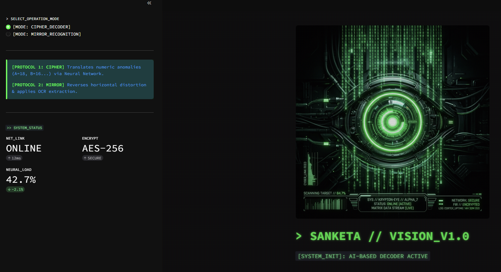
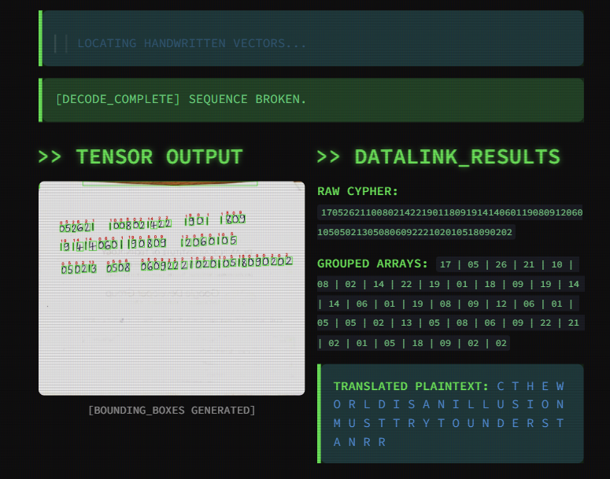
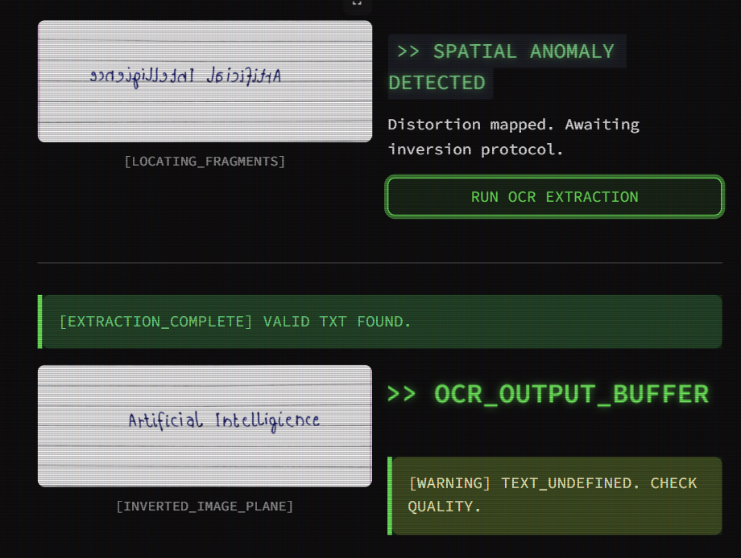

#  SANKETA // VISION_V1.0

<p align="center">
  <b>AI-Powered Visual Cipher & Mirror Text Decoder</b><br>
  A Cyberpunk-inspired Streamlit application for recovering hidden information from handwritten numeric ciphers and mirrored text patterns.
</p>

<p align="center">
  
  
  
  
</p>

---

## Overview

**Sanketa Vision** is an AI-powered decoding platform designed to recover information from visual anomalies. The system combines Computer Vision, Neural Networks, and OCR technologies to analyze encrypted visual patterns and reconstruct meaningful textual data.

The application offers two specialized decoding protocols:

* **Cipher Decoder Protocol** – Decodes handwritten numeric ciphers using a trained neural network.
* **Mirror Recognition Protocol** – Recovers text hidden within laterally inverted images.

---

## Core Features

###  Protocol 1: Cipher Decoder

Decode handwritten numeric sequences into readable text using a trained MNIST-based neural network.

#### Capabilities

* Handwritten digit detection using OpenCV
* Character segmentation via contour extraction
* Neural network-based digit recognition
* Numeric-to-text cipher translation
* Automatic PDF report generation
* Real-time decoding visualization

#### Workflow

```text
Image Upload
     ↓
Digit Detection
     ↓
Neural Prediction
     ↓
Cipher Translation
     ↓
PDF Report Generation
```

---

### 🪞 Protocol 2: Mirror Recognition

Recover text hidden within mirrored or laterally distorted images.

#### Capabilities

* Horizontal image reconstruction
* Mirror distortion correction
* OCR-based text extraction
* Dynamic Tesseract integration
* Real-time text recovery

#### Workflow

```text
Mirrored Image
       ↓
Horizontal Flip
       ↓
OCR Processing
       ↓
Recovered Text
```

---

##  Technology Stack

| Component        | Technology         |
| ---------------- | ------------------ |
| Frontend         | Streamlit          |
| Language         | Python             |
| Computer Vision  | OpenCV             |
| Machine Learning | TensorFlow / Keras |
| OCR Engine       | Tesseract OCR      |


## 📸 Application Preview

### Main Interface

<p align="center">
  
</p>

---

### Cipher Decoder Protocol

<p align="center">
  
</p>

---

### Mirror Recognition Protocol

<p align="center">
  
</p>

---

## 🎯 Learning Outcomes

This project demonstrates practical implementation of:

* Computer Vision with OpenCV
* Handwritten Digit Recognition
* Neural Networks using TensorFlow
* OCR Integration using Tesseract
* Streamlit Application Development
* Automated Report Generation
* Image Processing Techniques

<p align="center">
  <b>SANKETA // VISION_V1.0</b><br>
  <i>"Recovering Meaning from Visual Anomalies"</i>
</p>

<p align="center">
  [ END OF TRANSMISSION ]
</p>
